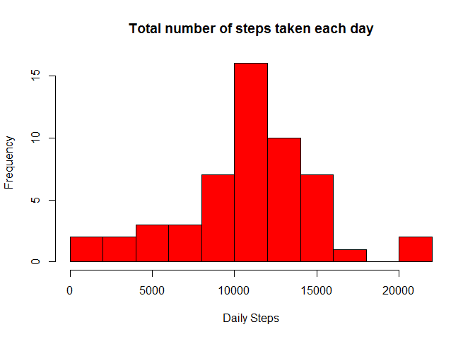
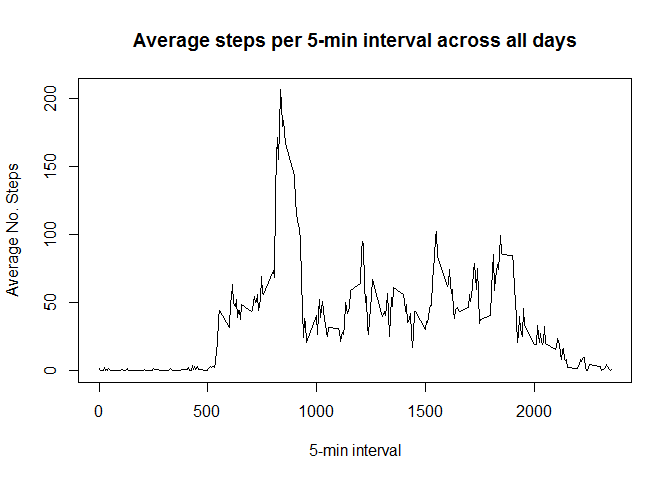
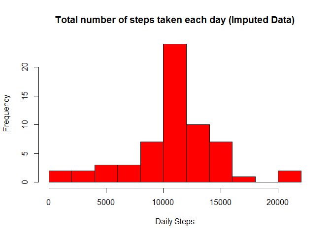
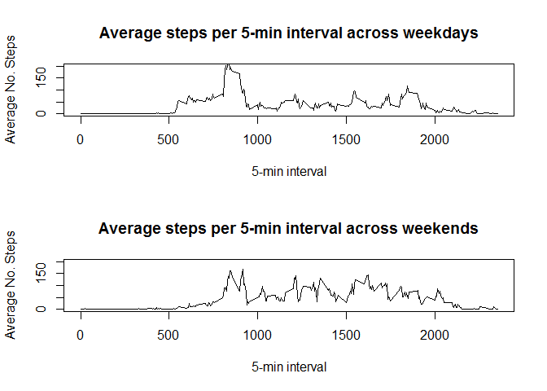

# Reproducible Research: Peer Assessment 1


## Loading and preprocessing the data

First we need to unzip the data file, then we read in it using the read.csv function. Lastly, we convert the date field to a date object to make manipulating the data easier.

```r
# unzip the data file
unzip("./activity.zip")

# read in the CSV data
activitydata <- read.csv("./activity.csv", header = TRUE, sep = ",")

# add a column that converts the Date string field to a Date object
activitydata["datetime"] <- as.Date(activitydata$date, format="%Y-%m-%d")
```


## What is mean total number of steps taken per day?

To do this we need to calculate the steps frequency per day. First, We will ignore the missing values.

```r
# subset the data without the missing values
activitydataNonMiss <- subset(activitydata, activitydata$steps != "NA")
```

Then we calculate the daily totals

```r
# calculate daily totals
dailyTotals <- aggregate(activitydataNonMiss$steps,by=list(activitydataNonMiss$datetime),FUN=sum)
```

Here is a histogram of the daily number of steps

```r
# daily steps histogram
hist(dailyTotals$x, xlab = "Daily Steps",
     main = "Total number of steps taken each day", breaks = 11, col = "red")
```



Then we calculate the mean and median from the daily totals

```r
# calculate the mean per day
meanDay <- mean(dailyTotals$x)

# calculate the median per day
medianDay <- median(dailyTotals$x)
```

The mean total number of steps per day = 10766
The median total number of steps per day = 10765

## What is the average daily activity pattern?

This time we need to compute the average per interval across all days.

```r
# calculate interval averages
intervalAvg <- aggregate(activitydataNonMiss$steps,by=list(activitydataNonMiss$interval),FUN=mean)
```

Here is a time series plot of the interval averages

```r
# Time series plot
plot(x = intervalAvg$Group.1, y = intervalAvg$x,type = "l",main = "Average steps per 5-min interval across all days", xlab = "5-min interval", ylab = "Average No. Steps")
```



Compute the max average No. steps per interval 

```r
# interval steps max 
intervalAvg <- intervalAvg[order(intervalAvg$x,decreasing = TRUE),]
maxInterval <- subset(intervalAvg[1,])
```
The interval which has the highest number of steps on average = 835 (206.17 Steps)


## Imputing missing values

First, compute the total number of rows containing NAs

```r
# Number of rows with missing data 
narows <- sum(is.na(activitydata$steps))
```

The number of rows with missing data = 2304

We are going to replace the missing data with the average for that interval from all the other days

```r
# create a copy of the data
imputedactivitydata <- activitydata

# use a for loop to recode the mising values using the interval averages calculated above
for (i in 1:nrow(imputedactivitydata)) {
  if(is.na(imputedactivitydata$steps[i])) {
    imputedactivitydata$steps[i] <- round((intervalAvg$x[intervalAvg$Group.1 == imputedactivitydata$interval[i]]),0)
  }
}
```

Here is a histogram of the imputed data for comparison with our earlier plot.

```r
# calculate daily totals
dailyTotals2 <- aggregate(imputedactivitydata$steps,by=list(imputedactivitydata$datetime),FUN=sum)

# daily steps histogram
hist(dailyTotals2$x, xlab = "Daily Steps",
     main = "Total number of steps taken each day (Imputed Data)", breaks = 11, col = "red")
```



We can compare the mean and median values to our earlier results

```r
# calculate the mean per day
meanDay2 <- mean(dailyTotals2$x)

# calculate the median per day
medianDay2 <- median(dailyTotals2$x)
```

Imputed Data  : mean = 10766 (rounded down)

Original Data : mean = 10766 (rounded up)

Imputed Data  : median = 10762

Original Data : median = 10765

So the imputing average values to replace missing data has slightly reduced the median value, however the mean remains the same once rounded to a whole number of steps.

## Are there differences in activity patterns between weekdays and weekends?

create a 2-level factor variable to distinguish weekday and weekend activity.

```r
# add extra columns
imputedactivitydata["weekday"] <- weekdays(imputedactivitydata$datetime)
imputedactivitydata["weekdays"] <- weekdays(imputedactivitydata$datetime)

# process the weekdays
for (i in 1:nrow(imputedactivitydata)) {
if(imputedactivitydata$weekdays[i] %in% c("Saturday","Sunday")) {
    imputedactivitydata$weekday[i] <- "weekend"
} else {
    imputedactivitydata$weekday[i] <- "weekday"
  }
}
# convert to factor
imputedactivitydata$weekday <- as.factor(imputedactivitydata$weekday)

# drop extra column
imputedactivitydata$weekdays <- NULL
```

Here is a pair of time-series plots to compare activity by interval over weekdays and weekends.

```r
# calculate interval averages for weekdays and weekends
intervalAvgWkday <- aggregate(imputedactivitydata$steps[imputedactivitydata$weekday == "weekday" ],by=list(imputedactivitydata$interval[imputedactivitydata$weekday == "weekday"]),FUN=mean)

intervalAvgWkend <- aggregate(imputedactivitydata$steps[imputedactivitydata$weekday == "weekend" ],by=list(imputedactivitydata$interval[imputedactivitydata$weekday == "weekend"]),FUN=mean)

# set the plot area
par(mfrow=c(2,1))

# Time series plot weekday
plot(x = intervalAvgWkday$Group.1, y = intervalAvgWkday$x,type = "l",main = "Average steps per 5-min interval across weekdays", xlab = "5-min interval", ylab = "Average No. Steps", ylim = c(0,200))

# Time series plot weekend
plot(x = intervalAvgWkend$Group.1, y = intervalAvgWkend$x,type = "l",main = "Average steps per 5-min interval across weekends", xlab = "5-min interval", ylab = "Average No. Steps", ylim = c(0,200))
```



From the two plots we can see that on average there is more activity earlier in the mornings during weekdays, however overall there is more acitvity throughout the day at weekends. This would fit with our expectations as weekday mornings often involve commuting activity. Also at weekends people usually have more leisure time and have the potential to be more active. 
